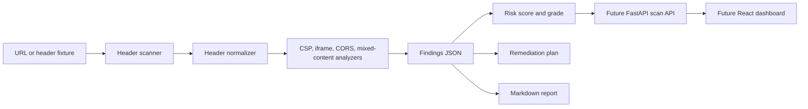

# Architecture

CSP Guardian is a defensive website security-header analyzer for CSP, clickjacking, CORS, cookies, mixed content, and iframe compatibility.

## Current MVP

- Loads offline fixtures or scans live URLs when network access is available.
- Normalizes headers to lower-case names for deterministic analysis.
- Produces findings for missing/weak CSP directives, clickjacking exposure, HSTS gaps, content-type hardening, mixed content, and broad CORS.
- Emits dashboard-friendly JSON plus a Markdown report.

## Future Product Shape

- FastAPI scan API with queued background scans.
- React dashboard for URL history, pass/fail matrix, remediation queue, and iframe compatibility preview.
- Optional scheduled monitoring for changed headers and CSP regressions.
